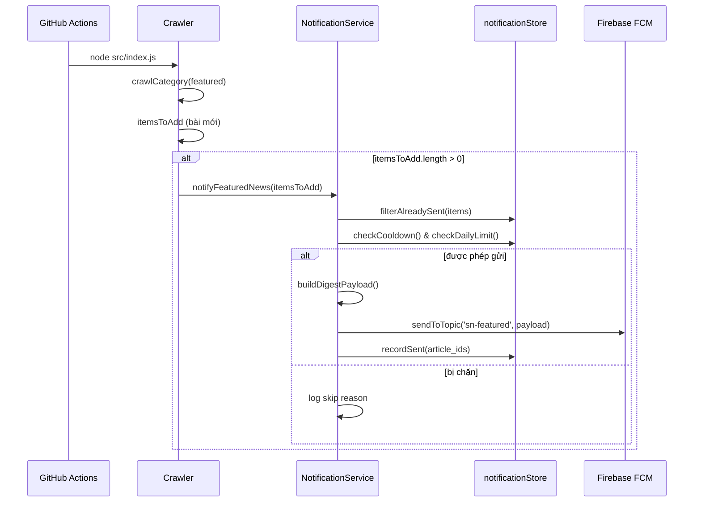

# Kế hoạch tích hợp Firebase Cloud Messaging (FCM)

> Tài liệu lên kế hoạch gửi push notification cho tin nổi bật, với thiết kế mở rộng để người dùng tự cài đặt thể loại và tần suất nhận thông báo.

---

## 1. Mục tiêu

| Mục tiêu | Mô tả |
|---|---|
| **Giai đoạn 1** | Gửi thông báo khi có tin mới trong danh mục `featured` (Tin nổi bật) |
| **Giới hạn spam** | Mặc định **3 thông báo/ngày/thiết bị**, rải **sáng–trưa–tối** (ICT) |
| **Bật/tắt** | User bật/tắt qua API preference hoặc unsubscribe topic phía app |
| **Cấu hình tần suất** | `max_per_day` mặc định 3, có thể chỉnh theo từng thiết bị (1–3) |
| **Giai đoạn 2+** | Người dùng chọn thể loại muốn nhận và tần suất (realtime / digest) |
| **Mở rộng** | Kiến trúc topic-based, schema linh hoạt, không phụ thuộc auth phức tạp ở MVP |

---

## 2. Bối cảnh hiện tại

### 2.1 Kiến trúc backend

```
GitHub Actions (crawler)       Express API (server.js)
        │                              │
        ▼                              ▼
  src/index.js                  GET /api/news?category=...
        │                              │
        ▼                              ▼
  repo vn-sport-news-data         Đọc JSON từ data/ (clone local)
    {categoryId}/
      meta/metadata.json
      chunks/chunk_*.json
```

- **Không có database** — dữ liệu tin lưu filesystem JSON trên repo riêng `TuanVuuuu/vn-sport-news-data`.
- **Repo code** (`vn-sport-news`) không commit thư mục `data/` — crawler push dữ liệu qua `DATA_REPO_TOKEN`.
- **Không có user model** — API public, stateless.
- **Crawler** chạy batch qua GitHub Actions (`.github/workflows/crawler.yml`), không chạy liên tục trên server API.
- **Tin nổi bật** = danh mục `featured`, crawl từ `https://vnexpress.net/rss/tin-noi-bat.rss` (xem `src/config/categories.js`).

### 2.2 Điểm hook tự nhiên

Trong `src/index.js`, hàm `crawlCategory()` đã phát hiện bài mới:

```js
let itemsToAdd = newItems.filter(item => !existingIds.has(item.id));
if (itemsToAdd.length === 0) return;
// ← Gửi FCM tại đây khi category.id === 'featured'
appendItems(id, metadata, itemsToAdd);
```

Payload bài viết sẵn có: `id`, `title`, `description`, `thumbnail_url`, `link`, `category_id`, `published_at`.

---

## 3. Nguyên tắc thiết kế

### 3.1 Không bắn quá nhiều thông báo

| Chiến lược | Cách áp dụng |
|---|---|
| **Chỉ gửi khi có bài mới thật** | So sánh `item.id` với `loadExistingIds()` — đã có sẵn |
| **Dedup theo bài** | Lưu `sent_notifications.json` — không gửi lại cùng `article_id` |
| **Gom nhóm (batch)** | Nếu 1 lần crawl có nhiều bài mới → gửi **1 thông báo tổng hợp**, không gửi từng bài |
| **Giới hạn tần suất** | Tối đa **N thông báo / ngày / thiết bị** (mặc định: **3**) |
| **Rải khung giờ** | Mỗi khung tối đa 1 lần: **Sáng 6–11h**, **Trưa 11–17h**, **Tối 17–22h** (ICT) |
| **Pending queue** | Bài mới ngoài khung giờ được giữ `pending_digest.json`, gửi ở lần crawl + slot kế tiếp |
| **Chỉ bài mới nhất** | Trong batch, highlight bài có `published_at` mới nhất làm nội dung chính |

**Ví dụ payload gom nhóm:**

```
Tiêu đề:  "3 tin nổi bật mới"
Nội dung: "Đội tuyển Việt Nam thắng 2-0 và 2 tin khác..."
Data:     { type: "featured_digest", article_ids: [...], highlight_id: "..." }
```

### 3.2 Hướng mở rộng

Thiết kế theo **FCM Topics** ngay từ đầu — mỗi thể loại = 1 topic, tần suất = topic riêng hoặc logic phía server:

```
Topic naming convention:
  sn-featured              → Tin nổi bật (MVP)
  sn-cat-{categoryId}      → Theo thể loại (phase 2)
  sn-freq-realtime         → Nhận ngay (phase 2)
  sn-freq-daily-digest     → Tổng hợp 1 lần/ngày (phase 2)
```

Người dùng subscribe/unsubscribe topic từ app — backend không cần biết từng device token ở giai đoạn đầu.

---

## 4. Kiến trúc đề xuất

```
┌─────────────────────────────────────────────────────────────┐
│                     Mobile App (Flutter/React Native)        │
│  - Đăng ký FCM token                                         │
│  - Subscribe topic: sn-featured                              │
│  - (Phase 2) UI cài đặt thể loại + tần suất                  │
└──────────────────────────┬──────────────────────────────────┘
                           │ FCM SDK
                           ▼
┌─────────────────────────────────────────────────────────────┐
│                    Firebase Cloud Messaging                  │
│  Topics: sn-featured, sn-cat-*, sn-freq-*                   │
└──────────────────────────▲──────────────────────────────────┘
                           │ firebase-admin SDK
┌──────────────────────────┴──────────────────────────────────┐
│              Notification Service (Node.js)                  │
│  src/services/notificationService.js                         │
│  - sendFeaturedDigest(items)                                 │
│  - shouldSend() — cooldown + daily limit + dedup           │
│  - (Phase 2) sendCategoryDigest(categoryId, items)          │
└──────────────────────────▲──────────────────────────────────┘
                           │ gọi sau crawl
┌──────────────────────────┴──────────────────────────────────┐
│                    Crawler (src/index.js)                    │
│  crawlCategory('featured') → itemsToAdd → notify if any     │
└─────────────────────────────────────────────────────────────┘
```

### 4.1 Tại sao gắn vào Crawler, không phải API server?

Crawler là nơi **phát hiện bài mới** và chạy định kỳ qua GitHub Actions. API server chỉ đọc dữ liệu, không biết khi nào có tin mới.

**Lưu ý CI:** Cần thêm Firebase service account vào GitHub Secrets để crawler gửi FCM trong workflow.

---

## 5. Cấu trúc file & module mới

```
src/
  config/
    notification.js          # Giới hạn tần suất, topic names, feature flags
  services/
    notificationService.js     # Logic gửi FCM, dedup, cooldown
  utils/
    notificationStore.js     # Đọc/ghi sent_notifications.json, send_log.json

data/
  notifications/
    sent_notifications.json  # { article_id: sent_at } — dedup vĩnh viễn
    send_log.json            # Lịch sử gửi — dùng cho cooldown & daily limit

docs/firebase/
  fcm-guild.md               # Tài liệu này
```

### 5.1 `src/config/notification.js`

```js
module.exports = {
  enabled: process.env.FCM_ENABLED === 'true',
  topics: { featured: 'sn-featured' },
  limits: {
    maxPerDay: 3,
    maxArticlesPerNotification: 5,
  },
  defaults: { enabled: true, maxPerDay: 3, categories: ['featured'] },
  timeSlots: [
    { id: 'morning', startHour: 6, endHour: 11 },
    { id: 'noon',    startHour: 11, endHour: 17 },
    { id: 'evening', startHour: 17, endHour: 22 },
  ],
};
```

### 5.2 `data/notifications/sent_notifications.json`

```json
{
  "https://vnexpress.net/bai-viet-abc.html": "2026-06-06T10:00:00.000Z"
}
```

### 5.3 `data/notifications/send_log.json`

```json
{
  "entries": [
    {
      "sent_at": "2026-06-06T10:00:00.000Z",
      "topic": "sn-featured",
      "type": "featured_digest",
      "article_ids": ["id1", "id2"],
      "highlight_id": "id1"
    }
  ]
}
```

---

## 6. Luồng gửi thông báo (Giai đoạn 1)



### 6.1 Thuật toán `canSendNow()`

```
1. FCM_ENABLED !== true → skip
2. itemsToSend rỗng (sau dedup) → skip
3. Thiết bị preferences.enabled === false → skip
4. Ngoài khung giờ sáng/trưa/tối (ICT) → giữ pending, skip
5. Khung hiện tại không nằm trong allowed slots theo max_per_day → skip
6. Đã gửi trong khung hiện tại hôm nay → skip
7. Số lần gửi hôm nay >= max_per_day → skip
8. → cho phép gửi
```

**Mapping `max_per_day` → khung giờ:**

| max_per_day | Khung được phép |
|---|---|
| 1 | Tối (17–22h) |
| 2 | Sáng + Tối |
| 3 | Sáng + Trưa + Tối |

### 6.2 Payload FCM

**Notification (hiển thị trên tray):**

```json
{
  "notification": {
    "title": "Tin nổi bật mới",
    "body": "Đội tuyển Việt Nam giành chiến thắng...",
    "image": "https://..."
  },
  "data": {
    "type": "featured_digest",
    "highlight_id": "article-url-or-guid",
    "article_count": "3",
    "category_id": "featured",
    "click_action": "OPEN_ARTICLE"
  }
}
```

**App xử lý `data.click_action`:**
- `OPEN_ARTICLE` → mở bài `highlight_id`
- `OPEN_CATEGORY` → mở danh sách `category_id` (phase 2)

---

## 7. Firebase setup

### 7.1 Tạo project Firebase

1. [Firebase Console](https://console.firebase.google.com/) → Tạo project `SportNews`
2. Thêm app Android + iOS (bundle ID khớp app mobile)
3. Tải `google-services.json` / `GoogleService-Info.plist` cho app

### 7.2 Service Account (backend)

1. Project Settings → Service accounts → Generate new private key
2. Lưu JSON vào biến môi trường (không commit):

```bash
# Local
export GOOGLE_APPLICATION_CREDENTIALS=/path/to/serviceAccountKey.json
export FCM_ENABLED=true

# GitHub Actions Secrets
FCM_SERVICE_ACCOUNT_JSON   # toàn bộ nội dung file JSON
FCM_ENABLED=true
```

### 7.3 Dependency

```bash
npm install firebase-admin
```

### 7.4 Khởi tạo SDK

```js
// src/services/notificationService.js
const admin = require('firebase-admin');

function initFirebase() {
  if (admin.apps.length) return admin;
  const cred = process.env.FCM_SERVICE_ACCOUNT_JSON
    ? JSON.parse(process.env.FCM_SERVICE_ACCOUNT_JSON)
    : undefined;
  admin.initializeApp({ credential: admin.credential.cert(cred) });
  return admin;
}
```

---

## 8. Tích hợp Mobile App

### 8.1 Giai đoạn 1 — Subscribe topic mặc định

```dart
// Flutter example
await FirebaseMessaging.instance.subscribeToTopic('sn-featured');
```

- Hỏi quyền notification khi user bật tính năng (không hỏi ngay khi mở app).
- Có toggle **Bật/Tắt tin nổi bật** → subscribe/unsubscribe `sn-featured`.

### 8.2 Giai đoạn 2 — Cài đặt thể loại & tần suất

**UI đề xuất:**

```
┌─────────────────────────────────────┐
│  Thông báo                          │
├─────────────────────────────────────┤
│  [✓] Tin nổi bật                    │
│  [✓] Thể thao                       │
│  [ ] Thế giới                       │
│  [✓] Bóng đá Việt Nam               │
│  ...                                │
├─────────────────────────────────────┤
│  Tần suất:                          │
│  (•) Ngay khi có tin mới            │
│  ( ) Tổng hợp 1 lần/ngày (8:00)     │
│  ( ) Tổng hợp 2 lần/ngày (8:00, 18:00)│
└─────────────────────────────────────┘
```

**Logic subscribe topic:**

| User chọn | Topics subscribe |
|---|---|
| Thể thao ON | `sn-cat-sports` |
| Tần suất realtime | `sn-freq-realtime` |
| Tần suất daily | `sn-freq-daily-digest` |

**Gửi từ backend (phase 2):** Dùng [FCM condition](https://firebase.google.com/docs/cloud-messaging/android/send-multiple) hoặc gửi riêng từng topic rồi dedup phía app:

```
condition: "'sn-cat-sports' in topics && 'sn-freq-realtime' in topics"
```

---

## 9. API thiết bị & cài đặt thông báo

> Hợp đồng API cho mobile: [fcm-mobile-guide.md](./fcm-mobile-guide.md). Phần dưới mô tả implementation và endpoint vận hành.

| Method | Endpoint | Mô tả |
|---|---|---|
| `GET` | `/api/notifications/settings` | Cấu hình mặc định: max_per_day, khung giờ, timezone |
| `POST` | `/api/devices/register` | Đăng ký FCM token + device_id + preferences |
| `GET` | `/api/devices/:deviceId/preferences` | Lấy cài đặt thiết bị |
| `PUT` | `/api/devices/:deviceId/preferences` | Bật/tắt (`enabled`), đổi `max_per_day` |
| `DELETE` | `/api/devices/:deviceId` | Hủy đăng ký thiết bị |
| `POST` | `/api/notifications/test` | Gửi push test tới token hoặc topic (QA/backend) |

### 9.1 Lưu trữ thiết bị

API server (`server.js`) ghi `devices.json` lên repo data GitHub tại `notifications/devices.json` ([vn-sport-news-data](https://github.com/TuanVuuuu/vn-sport-news-data/blob/main/notifications/devices.json)). Crawler đọc cùng file khi gửi push — mỗi thiết bị có `max_per_day` / `enabled` riêng.

**Schema `device`:**

```json
{
  "device_id": "uuid",
  "fcm_token": "...",
  "platform": "android|ios",
  "preferences": {
    "categories": ["featured"],
    "enabled": true,
    "max_per_day": 3
  },
  "created_at": "ISO",
  "updated_at": "ISO"
}
```

### 9.2 API gửi push test

Dành cho QA / backend dev. Bỏ qua khung giờ, dedup; **không** ghi `sent_notifications.json` / `send_log.json`.

**`POST /api/notifications/test`**

Gửi tới token:

```json
{
  "target": "token",
  "fcm_token": "...",
  "variant": "single"
}
```

Hoặc qua `device_id` đã register (server tra token từ `devices.json`):

```json
{
  "device_id": "550e8400-e29b-41d4-a716-446655440000",
  "variant": "single"
}
```

Gửi tới topic:

```json
{
  "target": "topic",
  "topic": "sn-featured",
  "variant": "digest"
}
```

Tuỳ chỉnh nội dung (ghi đè mẫu mặc định, field nào không gửi thì dùng giá trị từ `variant`):

```json
{
  "target": "token",
  "fcm_token": "...",
  "content": {
    "title": "Thông báo test tuỳ chỉnh",
    "body": "Nội dung bạn muốn hiển thị trên tray",
    "image": "https://example.com/thumb.jpg",
    "highlight_id": "test://sportnews/my-article",
    "click_action": "OPEN_ARTICLE",
    "article_count": 1
  }
}
```

| Field `content` | Mô tả |
|---|---|
| `title` | Tiêu đề notification |
| `body` | Nội dung notification |
| `image` | URL ảnh (để trống `""` để bỏ ảnh) |
| `highlight_id` | ID bài khi user tap — mặc định `test://sportnews/...` |
| `click_action` | Mặc định `OPEN_ARTICLE` |
| `article_count` | Số bài trong digest — mặc định theo `variant` |

Payload luôn có `data.is_test = "true"`.

Bảo vệ endpoint (tuỳ chọn): set `FCM_TEST_SECRET` — client gửi header `X-FCM-Test-Secret` hoặc field `secret` trong body.

### 9.3 Cấu hình server API (Render)

| Biến | Bắt buộc | Mô tả |
|---|---|---|
| `DATA_REPO_TOKEN` | Có | GitHub PAT ghi repo `vn-sport-news-data` — lưu `devices.json` |
| `FCM_SERVICE_ACCOUNT_JSON` | Có (nếu dùng API test) | JSON service account Firebase |
| `FCM_TEST_SECRET` | Không | Bảo vệ `POST /api/notifications/test` |

API test **không** cần `FCM_ENABLED=true`. Crawler production vẫn cần `FCM_ENABLED` + `FCM_SERVICE_ACCOUNT_JSON` trên GitHub Actions.

---

## 10. Mở rộng theo thể loại (Giai đoạn 2)

### 10.1 Hook crawler cho nhiều category

```js
// src/config/notification.js
const notifiableCategories = ['featured', 'sports', 'vietnam-football'];

// src/index.js — sau appendItems
if (notifiableCategories.includes(id)) {
  await notifyCategoryNews(id, itemsToAdd);
}
```

### 10.2 Digest theo ngày

Thêm workflow GitHub Actions riêng chạy 8:00 / 18:00:

```yaml
# .github/workflows/daily-digest.yml
on:
  schedule:
    - cron: '0 1 * * *'   # 8:00 ICT
```

Gửi tổng hợp tin mới trong 24h qua topic `sn-freq-daily-digest` + `sn-cat-*`.

---

## 11. Biến môi trường

| Biến | Nơi dùng | Bắt buộc | Mô tả |
|---|---|---|---|
| `FCM_ENABLED` | Crawler (GitHub Actions) | Có | `true` để bật gửi, `false` để tắt |
| `FCM_SERVICE_ACCOUNT_JSON` | Crawler; API server (nếu test push) | Có (prod) | JSON service account, 1 dòng |
| `FCM_MAX_PER_DAY` | Crawler | Không | Giới hạn mặc định khi chưa có preference thiết bị (mặc định **3**) |
| `FCM_MAX_ARTICLES_PER_NOTIFICATION` | Crawler | Không | Số bài gom tối đa mỗi push (mặc định 5) |
| `DATA_REPO_TOKEN` | API server (Render) | Có | PAT ghi `devices.json` lên data repo |
| `FCM_TEST_SECRET` | API server | Không | Bảo vệ endpoint test push |

---

## 12. Lộ trình triển khai

### Phase 1 — MVP (1–2 tuần)

- [ ] Tạo Firebase project + service account
- [ ] Cài `firebase-admin`
- [ ] `src/config/notification.js`
- [ ] `src/services/notificationService.js` — gửi topic `sn-featured`
- [ ] `src/utils/notificationStore.js` — dedup + send log
- [ ] Hook vào `crawlCategory()` khi `id === 'featured'`
- [ ] Thêm secrets vào GitHub Actions workflow
- [ ] Mobile: subscribe `sn-featured`, xử lý tap notification
- [ ] Test end-to-end trên thiết bị thật

### Phase 2 — Cài đặt thể loại (2–3 tuần)

- [ ] Định nghĩa topic `sn-cat-{id}` cho từng category trong `categories.js`
- [ ] Mở rộng crawler hook cho `notifiableCategories`
- [ ] Mobile UI: chọn thể loại, subscribe/unsubscribe topics
- [ ] Condition-based send hoặc gửi per-topic

### Phase 3 — Tần suất & digest (2 tuần)

- [ ] Topic `sn-freq-realtime`, `sn-freq-daily-digest`
- [ ] Mobile UI: chọn tần suất
- [ ] Workflow `daily-digest.yml`
- [ ] `shouldSend()` tách logic theo frequency

### Phase 4 — Tùy chọn nâng cao

- [ ] API `/api/devices/register` + lưu preference
- [ ] Chuyển `notificationStore` sang database (SQLite/PostgreSQL) nếu scale
- [ ] A/B test nội dung notification
- [ ] Analytics: open rate, unsubscribe rate

---

## 13. Kiểm thử

| Kịch bản | Kỳ vọng |
|---|---|
| Crawl featured, 0 bài mới | Không gửi |
| Crawl featured, 1 bài mới | Gửi 1 notification |
| Crawl featured, 5 bài mới cùng lúc | Gửi 1 digest "5 tin nổi bật mới" |
| Gửi xong, crawl lại cùng bài | Không gửi (dedup) |
| Gửi xong, crawl bài mới sau 10 phút | Không gửi (cooldown) |
| Đã gửi 3 lần trong ngày (mỗi khung 1 lần) | Không gửi (daily limit) |
| Crawl lúc 2h sáng có bài mới | Giữ pending, gửi ở khung sáng tiếp theo |
| User `enabled=false` | Không gửi tới thiết bị đó |
| User `max_per_day=1` | Chỉ gửi trong khung tối |
| `FCM_ENABLED=false` | Skip, crawler vẫn chạy bình thường |
| User unsubscribe `sn-featured` | Không nhận notification |

---

## 14. Rủi ro & giảm thiểu

| Rủi ro | Giảm thiểu |
|---|---|
| Spam notification | Dedup + cooldown + daily limit + digest |
| Service account lộ | Chỉ dùng GitHub Secrets / env, không commit |
| Crawler fail vì FCM lỗi | Wrap `notifyFeaturedNews` trong try/catch, không block crawl |
| Topic subscribe sai | Convention rõ ràng `sn-*`, document cho mobile team |
| Scale lớn (nhiều topic) | FCM topic hỗ trợ tới hàng triệu subscriber |
| User tắt notification OS-level | Không kiểm soát được — chỉ optimize nội dung |

---

## 15. Quyết định kiến trúc đã chốt

| Quyết định | Lý do |
|---|---|
| FCM Topics thay vì lưu token ngay | Đơn giản MVP, không cần DB user |
| Gắn vào Crawler | Nơi duy nhất biết có bài mới |
| File JSON cho dedup/log | Nhất quán với kiến trúc hiện tại, dễ commit trong `data/notifications/` |
| Digest thay vì từng bài | Giảm spam, UX tốt hơn |
| Topic naming `sn-*` | Tránh conflict với topic khác trong cùng Firebase project |

---

## 16. Tham khảo

- Mobile integration: [fcm-mobile-guide.md](./fcm-mobile-guide.md)
- Postman FCM: [postman_collection_fcm.json](../v1/postman_collection_fcm.json)
- Devices storage: [notifications/devices.json](https://github.com/TuanVuuuu/vn-sport-news-data/blob/main/notifications/devices.json)
- [Firebase Admin SDK — Node.js](https://firebase.google.com/docs/admin/setup)
- [FCM Topic Messaging](https://firebase.google.com/docs/cloud-messaging/android/topic-messaging)
- [FCM Condition Messaging](https://firebase.google.com/docs/cloud-messaging/android/send-multiple)
- Codebase: `src/index.js`, `src/services/notificationService.js`, `server.js`, `.github/workflows/crawler.yml`
