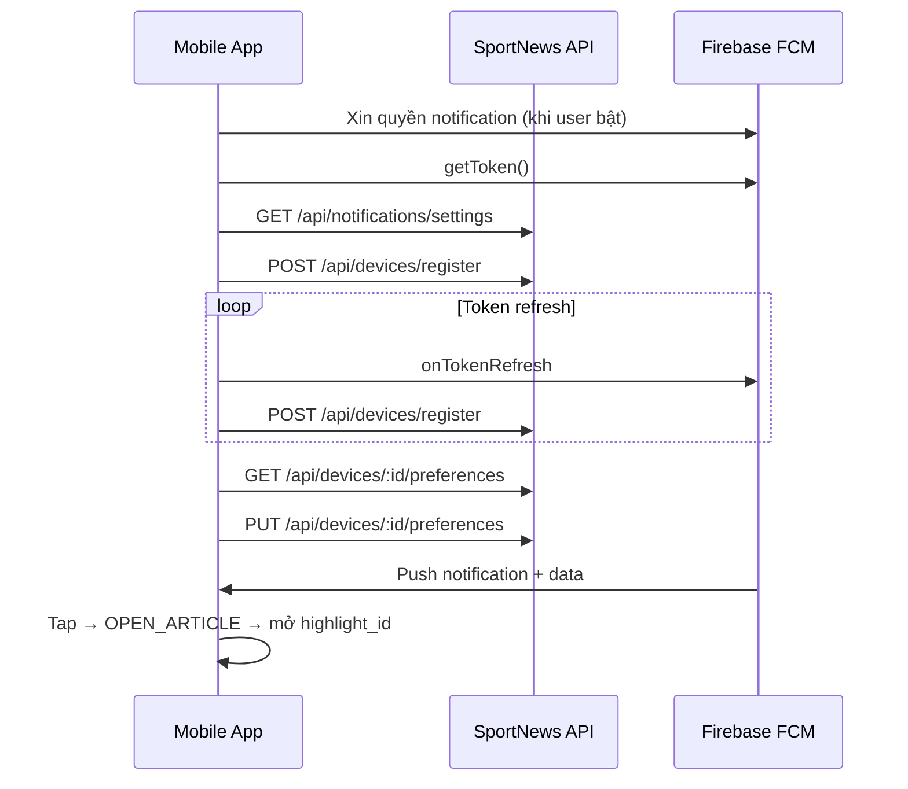

# Hướng dẫn tích hợp FCM cho Mobile

> Tài liệu dành cho team mobile (Flutter / React Native / native). Chỉ mô tả những gì app cần gọi, nhận và xử lý.

---

## 1. Tổng quan

App nhận push khi có **tin nổi bật mới**. Có hai cách:

| Cách | App cần làm |
|---|---|
| **FCM Topic** | `subscribeToTopic('sn-featured')` — không cần gọi API |
| **Đăng ký thiết bị** | Gọi `POST /api/devices/register` với `device_id` + `fcm_token` |

**Khuyến nghị:** Dùng **API đăng ký** nếu có màn cài đặt (bật/tắt, chọn tần suất). Chưa có màn cài đặt thì chỉ subscribe topic.

### Tần suất (hiển thị trên UI)

User chọn `max_per_day` từ 1–3. Dùng bảng sau để giải thích trên màn cài đặt (label khung giờ lấy từ `GET /api/notifications/settings` → `time_slots`):

| `max_per_day` | Ý nghĩa với user |
|---|---|
| 1 | Tối đa 1 thông báo/ngày (khung tối) |
| 2 | Tối đa 2 thông báo/ngày (sáng + tối) |
| 3 | Tối đa 3 thông báo/ngày (sáng + trưa + tối) |

---

## 2. Quy ước response API

Tất cả API trả **HTTP 200**. Kiểm tra field `status`:

```json
// Thành công
{ "status": 1, "body": { "data": { ... } } }

// Lỗi
{ "status": 0, "body": { "message": "Mô tả lỗi" } }
```

**Base URL:** `http://localhost:3005` (dev) — thay bằng URL production khi deploy.

**Headers:** `Content-Type: application/json` cho request có body.

---

## 3. Danh sách API

### 3.1 `GET /api/notifications/settings`

Lấy cấu hình để vẽ màn **Cài đặt thông báo** (khung giờ, giới hạn, topic FCM).

**Response mẫu:**

```json
{
  "status": 1,
  "body": {
    "data": {
      "enabled": true,
      "defaults": {
        "enabled": true,
        "maxPerDay": 3,
        "categories": ["featured"]
      },
      "limits": {
        "max_per_day": 3,
        "max_articles_per_notification": 5
      },
      "time_slots": [
        { "id": "morning", "label": "Sáng", "start_hour": 6, "end_hour": 11 },
        { "id": "noon", "label": "Trưa", "start_hour": 11, "end_hour": 17 },
        { "id": "evening", "label": "Tối", "start_hour": 17, "end_hour": 22 }
      ],
      "timezone": "Asia/Ho_Chi_Minh",
      "topic": "sn-featured"
    }
  }
}
```

| Field | Dùng trên app |
|---|---|
| `defaults.maxPerDay` | Giá trị mặc định khi user chưa tùy chỉnh |
| `limits.max_per_day` | Giới hạn tối đa cho phép chọn (1–3) |
| `time_slots` | Label khung giờ hiển thị cho user |
| `topic` | Tên topic FCM nếu dùng subscribe topic |

---

### 3.2 `POST /api/devices/register`

Đăng ký hoặc cập nhật thiết bị. Gọi khi:

- Có FCM token lần đầu
- Token refresh (`onTokenRefresh`)
- User bật lại thông báo

**Request body:**

```json
{
  "device_id": "550e8400-e29b-41d4-a716-446655440000",
  "fcm_token": "dGhpcyBpcyBhIGZha2UgdG9rZW4...",
  "platform": "android",
  "preferences": {
    "enabled": true,
    "max_per_day": 3,
    "categories": ["featured"]
  }
}
```

| Field | Bắt buộc | Mô tả |
|---|---|---|
| `device_id` | Có | UUID cố định, lưu local (SharedPreferences / Keychain) |
| `fcm_token` | Có | `FirebaseMessaging.instance.getToken()` |
| `platform` | Không | `"android"` hoặc `"ios"` |
| `preferences.enabled` | Không | `true` = nhận push. Mặc định `true` |
| `preferences.max_per_day` | Không | `1`, `2` hoặc `3`. Mặc định `3` |
| `preferences.categories` | Không | Hiện chỉ `["featured"]` |

Gọi lại cùng `device_id` sẽ **cập nhật** (upsert) `fcm_token`. Nếu **không gửi `preferences`**, server **giữ nguyên** cài đặt cũ. Chỉ gửi `preferences` khi đăng ký lần đầu hoặc muốn ghi đè có chủ đích.

**Token refresh / mở app:** chỉ cần gửi `device_id` + `fcm_token` — không cần gửi `preferences`.

---

### 3.3 `GET /api/devices/:deviceId/preferences`

Đồng bộ UI cài đặt từ server.

```
GET /api/devices/550e8400-e29b-41d4-a716-446655440000/preferences
```

Chưa register → lỗi `"Không tìm thấy thiết bị."` → gọi `POST /api/devices/register` trước.

---

### 3.4 `PUT /api/devices/:deviceId/preferences`

Cập nhật một phần — chỉ gửi field thay đổi:

```json
{ "enabled": false }
```

```json
{ "max_per_day": 1 }
```

| Field | Mô tả |
|---|---|
| `enabled` | `true` = nhận push, `false` = tắt |
| `max_per_day` | `1`, `2` hoặc `3` (xem bảng mục 1) |
| `categories` | Hiện chỉ `["featured"]` |

---

### 3.5 `DELETE /api/devices/:deviceId`

Xóa thiết bị khỏi server khi user tắt hoàn toàn thông báo.

```
DELETE /api/devices/550e8400-e29b-41d4-a716-446655440000
```

Sau khi xóa, **unsubscribe** topic `sn-featured` nếu app đã subscribe.

---

## 4. Xử lý notification trên app

### 4.1 Payload nhận được

**Notification (tray):**

```json
{
  "title": "3 tin nổi bật mới",
  "body": "Đội tuyển Việt Nam thắng 2-0 và 2 tin khác",
  "image": "https://..."
}
```

**Data (logic app):**

```json
{
  "type": "featured_digest",
  "highlight_id": "https://vnexpress.net/bai-viet-abc.html",
  "article_count": "3",
  "category_id": "featured",
  "click_action": "OPEN_ARTICLE"
}
```

**Push test** thêm field `is_test: "true"` và `highlight_id` dạng `test://sportnews/...` — app nên mở màn debug thay vì bài thật.

### 4.2 Tap notification

| `click_action` | Hành vi app |
|---|---|
| `OPEN_ARTICLE` | Mở bài có `id` = `highlight_id` |
| `OPEN_CATEGORY` | (Phase 2) Mở danh sách `category_id` |

`highlight_id` trùng `id` bài viết trong API `/api/news`.

### 4.3 Subscribe topic (tuỳ chọn)

Nếu không dùng API register:

```dart
await FirebaseMessaging.instance.subscribeToTopic('sn-featured');
await FirebaseMessaging.instance.unsubscribeFromTopic('sn-featured'); // tắt
```

Topic name lấy từ `GET /api/notifications/settings` → `topic`.

**Android:** tạo notification channel `featured_news` (backend gửi kèm `channelId` này).

---

## 5. Luồng tích hợp



### Checklist

- [ ] Tạo và lưu `device_id` (UUID) cố định
- [ ] Xin quyền notification khi user **bật tính năng**
- [ ] `POST /api/devices/register` sau khi có token
- [ ] Lắng nghe token refresh → gọi lại register
- [ ] Màn cài đặt: `GET settings` + `GET preferences`, cập nhật bằng `PUT preferences`
- [ ] Xử lý tap theo `click_action` và `highlight_id`
- [ ] Nhận diện `is_test === "true"` khi test push
- [ ] (Tuỳ chọn) Subscribe/unsubscribe topic `sn-featured`

---

## 6. Test push trên thiết bị

Nhờ backend/QA gọi `POST /api/notifications/test` (Postman: `docs/v1/postman_collection_fcm.json`).

App cần chuẩn bị:

1. Đã register (`POST /api/devices/register`) hoặc subscribe topic `sn-featured`
2. Xử lý payload có `data.is_test === "true"`

Chi tiết endpoint và cấu hình server: [fcm-guild.md §9.2](./fcm-guild.md#92-api-gửi-push-test).

---

## 7. FAQ

**Q: Dùng topic hay API register?**  
A: API register cho phép user bật/tắt và chọn tần suất. Topic đơn giản hơn, không cần gọi API.

**Q: `enabled: false` có cần unsubscribe topic không?**  
A: Có — tránh vẫn nhận push qua topic khi đã tắt trên app.

**Q: Notification không đến?**  
A: Kiểm tra: quyền OS, FCM token còn hợp lệ, đã register hoặc subscribe topic, `preferences.enabled = true`.

**Q: Phase 2 có gì mới?**  
A: Chọn thể loại (`categories`), nhiều topic `sn-cat-*`. Hiện chỉ `featured`.

---

## 8. Tham khảo

- Backend (logic gửi, env, crawler): [fcm-guild.md](./fcm-guild.md)
- Postman: [postman_collection_fcm.json](../v1/postman_collection_fcm.json)
- [FCM Topic Messaging](https://firebase.google.com/docs/cloud-messaging/android/topic-messaging)
