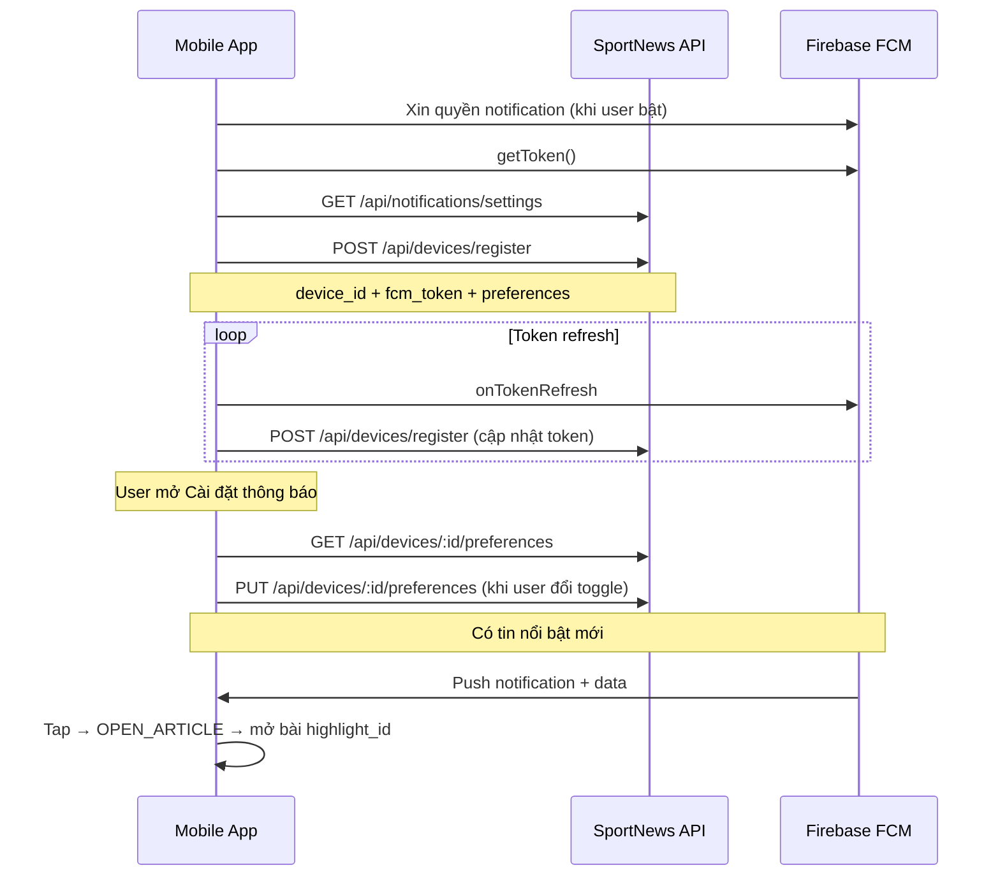

# Hướng dẫn tích hợp FCM cho Mobile

> Tài liệu dành cho team mobile (Flutter / React Native / native). Mô tả cách gọi API, ý nghĩa từng endpoint và luồng tích hợp push notification tin nổi bật.

---

## 1. Tổng quan

SportNews gửi push notification khi có **tin nổi bật mới** (`category: featured`). Backend hỗ trợ **hai cách nhận thông báo**:

| Cách | Mô tả | Khi nào dùng |
|---|---|---|
| **FCM Topic** | App subscribe topic `sn-featured` | MVP đơn giản, không cần gọi API |
| **Đăng ký thiết bị qua API** | App gửi `device_id` + `fcm_token` lên server | Cần bật/tắt, giới hạn tần suất theo từng thiết bị |

**Khuyến nghị:** Dùng **API đăng ký thiết bị** để user có thể tùy chỉnh `max_per_day` và `enabled`. Nếu chưa có màn cài đặt, có thể chỉ subscribe topic `sn-featured` qua FCM SDK.

### Giới hạn mặc định

- Tối đa **3 thông báo/ngày**, rải **sáng – trưa – tối** (giờ Việt Nam, ICT)
- Nhiều bài mới trong 1 lần crawl → gộp thành **1 thông báo digest**
- Bài mới ngoài khung giờ → giữ pending, gửi ở khung kế tiếp

| `max_per_day` | Khung giờ được gửi |
|---|---|
| 1 | Tối (17h–22h) |
| 2 | Sáng (6h–11h) + Tối |
| 3 | Sáng + Trưa (11h–17h) + Tối |

---

## 2. Quy ước response API

Tất cả API trả **HTTP 200**. Mobile kiểm tra field `status`:

```json
// Thành công
{
  "status": 1,
  "body": { "data": { ... } }
}

// Lỗi nghiệp vụ
{
  "status": 0,
  "body": { "message": "Mô tả lỗi" }
}
```

**Base URL:** `http://localhost:3005` (dev) — thay bằng URL production khi deploy.

**Headers:** `Content-Type: application/json` cho các request có body.

**Lưu trữ thiết bị:** API server ghi `devices.json` lên repo data GitHub tại `notifications/devices.json` ([vn-sport-news-data](https://github.com/TuanVuuuu/vn-sport-news-data/blob/main/notifications/devices.json)). Crawler đọc cùng file này khi gửi push — mỗi thiết bị có `max_per_day` / `enabled` riêng hoạt động đúng trên production.

---

## 3. Danh sách API

### 3.1 `GET /api/notifications/settings`

**Mục đích:** Lấy cấu hình hệ thống để hiển thị UI cài đặt (khung giờ, giới hạn mặc định, topic FCM).

**Khi gọi:**
- Mở màn hình **Cài đặt thông báo** lần đầu
- Cần hiển thị label khung giờ (Sáng / Trưa / Tối) cho user

**Request:** Không có body, không có query param.

**Response mẫu:**

```json
{
  "status": 1,
  "body": {
    "data": {
      "enabled": true,
      "defaults": {
        "enabled": true,
        "maxPerDay": 3,
        "categories": ["featured"]
      },
      "limits": {
        "max_per_day": 3,
        "max_articles_per_notification": 5
      },
      "time_slots": [
        { "id": "morning", "label": "Sáng", "start_hour": 6, "end_hour": 11 },
        { "id": "noon", "label": "Trưa", "start_hour": 11, "end_hour": 17 },
        { "id": "evening", "label": "Tối", "start_hour": 17, "end_hour": 22 }
      ],
      "timezone": "Asia/Ho_Chi_Minh",
      "topic": "sn-featured"
    }
  }
}
```

**Ý nghĩa các field:**

| Field | Ý nghĩa |
|---|---|
| `enabled` | Server có đang bật gửi FCM không (`FCM_ENABLED`) |
| `defaults.maxPerDay` | Số thông báo/ngày mặc định khi user chưa tùy chỉnh |
| `limits.max_per_day` | Giới hạn tối đa server cho phép (1–3) |
| `time_slots` | Khung giờ ICT — dùng để giải thích cho user |
| `topic` | Topic FCM mặc định (`sn-featured`) — dùng nếu subscribe topic |

---

### 3.2 `POST /api/devices/register`

**Mục đích:** Đăng ký hoặc cập nhật thiết bị với FCM token và preferences. Server sẽ gửi push **trực tiếp tới token** thay vì chỉ qua topic.

**Khi gọi:**
- App khởi động lần đầu (sau khi có FCM token)
- FCM token refresh (Firebase gọi `onTokenRefresh`)
- User bật thông báo sau khi từng tắt
- Đổi `device_id` (reinstall app) — gọi lại với token mới

**Request body:**

```json
{
  "device_id": "550e8400-e29b-41d4-a716-446655440000",
  "fcm_token": "dGhpcyBpcyBhIGZha2UgdG9rZW4...",
  "platform": "android",
  "preferences": {
    "enabled": true,
    "max_per_day": 3,
    "categories": ["featured"]
  }
}
```

| Field | Bắt buộc | Mô tả |
|---|---|---|
| `device_id` | Có | UUID cố định do app tạo và lưu local (SharedPreferences / Keychain) |
| `fcm_token` | Có | Token từ `FirebaseMessaging.instance.getToken()` |
| `platform` | Không | `"android"` hoặc `"ios"` — mặc định `"unknown"` |
| `preferences.enabled` | Không | `true` = nhận thông báo, `false` = tắt. Mặc định `true` |
| `preferences.max_per_day` | Không | 1, 2 hoặc 3. Mặc định `3` |
| `preferences.categories` | Không | Hiện chỉ hỗ trợ `["featured"]` |

**Response mẫu:**

```json
{
  "status": 1,
  "body": {
    "data": {
      "device_id": "550e8400-e29b-41d4-a716-446655440000",
      "fcm_token": "dGhpcyBpcyBhIGZha2UgdG9rZW4...",
      "platform": "android",
      "preferences": {
        "enabled": true,
        "max_per_day": 3,
        "categories": ["featured"]
      },
      "created_at": "2026-06-06T10:00:00.000Z",
      "updated_at": "2026-06-06T10:00:00.000Z"
    }
  }
}
```

**Lỗi thường gặp:**

```json
{ "status": 0, "body": { "message": "Thiếu device_id hoặc fcm_token." } }
```

> **Lưu ý:** Gọi lại endpoint này với cùng `device_id` sẽ **cập nhật** (upsert), không tạo bản ghi trùng.

---

### 3.3 `GET /api/devices/:deviceId/preferences`

**Mục đích:** Lấy cài đặt hiện tại của thiết bị từ server — đồng bộ UI khi user mở màn cài đặt.

**Khi gọi:**
- Mở màn **Cài đặt thông báo**
- App reinstall nhưng giữ cùng `device_id` — khôi phục preferences

**Request:** Thay `:deviceId` bằng UUID đã lưu local.

```
GET /api/devices/550e8400-e29b-41d4-a716-446655440000/preferences
```

**Response mẫu:**

```json
{
  "status": 1,
  "body": {
    "data": {
      "device_id": "550e8400-e29b-41d4-a716-446655440000",
      "preferences": {
        "enabled": true,
        "max_per_day": 2,
        "categories": ["featured"]
      },
      "updated_at": "2026-06-06T12:00:00.000Z"
    }
  }
}
```

**Lỗi:**

```json
{ "status": 0, "body": { "message": "Không tìm thấy thiết bị." } }
```

→ Gọi `POST /api/devices/register` trước.

---

### 3.4 `PUT /api/devices/:deviceId/preferences`

**Mục đích:** Cập nhật một phần preferences — bật/tắt thông báo, đổi tần suất, đổi danh mục (phase sau).

**Khi gọi:**
- User bật/tắt toggle **Tin nổi bật**
- User chọn tần suất (1 / 2 / 3 lần/ngày)
- (Phase 2) User chọn thể loại muốn nhận

**Request body** — chỉ gửi field cần thay đổi:

```json
{
  "enabled": false
}
```

```json
{
  "max_per_day": 1
}
```

| Field | Kiểu | Mô tả |
|---|---|---|
| `enabled` | `boolean` | `true` = nhận push, `false` = server bỏ qua thiết bị này |
| `max_per_day` | `number` | 1, 2 hoặc 3 — ảnh hưởng khung giờ được gửi (xem bảng mục 1) |
| `categories` | `string[]` | Hiện chỉ `["featured"]`; phase 2 sẽ mở rộng |

**Response mẫu:**

```json
{
  "status": 1,
  "body": {
    "data": {
      "device_id": "550e8400-e29b-41d4-a716-446655440000",
      "preferences": {
        "enabled": false,
        "max_per_day": 3,
        "categories": ["featured"]
      },
      "updated_at": "2026-06-06T14:00:00.000Z"
    }
  }
}
```

**Lỗi:**

```json
{ "status": 0, "body": { "message": "Không tìm thấy thiết bị. Hãy gọi POST /api/devices/register trước." } }
```

```json
{ "status": 0, "body": { "message": "max_per_day phải là số nguyên >= 1." } }
```

---

### 3.5 `DELETE /api/devices/:deviceId`

**Mục đích:** Xóa thiết bị khỏi server — server không còn gửi push tới token đó.

**Khi gọi:**
- User chọn **Tắt hoàn toàn thông báo** và xóa dữ liệu
- Logout / xóa tài khoản (nếu có)
- Uninstall cleanup (tuỳ chọn)

**Request:**

```
DELETE /api/devices/550e8400-e29b-41d4-a716-446655440000
```

**Response mẫu:**

```json
{
  "status": 1,
  "body": {
    "data": {
      "device_id": "550e8400-e29b-41d4-a716-446655440000",
      "removed": true
    }
  }
}
```

**Lỗi:**

```json
{ "status": 0, "body": { "message": "Không tìm thấy thiết bị." } }
```

> Sau khi xóa, nên **unsubscribe** topic `sn-featured` phía FCM SDK nếu app đã subscribe.

---

## 4. Xử lý notification trên app

### 4.1 Payload nhận được

Khi user nhận push, FCM gửi kèm:

**Notification (hiển thị trên tray):**

```json
{
  "title": "3 tin nổi bật mới",
  "body": "Đội tuyển Việt Nam thắng 2-0 và 2 tin khác",
  "image": "https://..."
}
```

**Data (xử lý logic app):**

```json
{
  "type": "featured_digest",
  "highlight_id": "https://vnexpress.net/bai-viet-abc.html",
  "article_count": "3",
  "category_id": "featured",
  "click_action": "OPEN_ARTICLE"
}
```

### 4.2 Xử lý khi user tap notification

| `click_action` | Hành vi app |
|---|---|
| `OPEN_ARTICLE` | Mở chi tiết bài viết có `id` = `highlight_id` |
| `OPEN_CATEGORY` | (Phase 2) Mở danh sách category `category_id` |

`highlight_id` trùng với `id` bài viết trong API `/api/news`.

### 4.3 Subscribe topic (tuỳ chọn)

Nếu **không** dùng API register, app cần subscribe topic khi user bật thông báo:

```dart
// Flutter
await FirebaseMessaging.instance.subscribeToTopic('sn-featured');
```

```dart
// Tắt thông báo
await FirebaseMessaging.instance.unsubscribeFromTopic('sn-featured');
```

Topic name lấy từ `GET /api/notifications/settings` → field `topic`.

---

## 5. Luồng tích hợp đề xuất



### Checklist triển khai

- [ ] Tạo và lưu `device_id` (UUID) cố định trên thiết bị
- [ ] Xin quyền notification **khi user bật tính năng**, không hỏi ngay khi mở app
- [ ] Gọi `POST /api/devices/register` sau khi có FCM token
- [ ] Lắng nghe token refresh → gọi lại register
- [ ] Màn cài đặt: gọi `GET settings` + `GET preferences`, cập nhật bằng `PUT preferences`
- [ ] Xử lý tap notification theo `click_action` và `highlight_id`
- [ ] (Tuỳ chọn) Subscribe/unsubscribe topic `sn-featured` song song với API

---

## 6. Postman Collection

Import file `docs/v1/postman_collection_fcm.json` vào Postman để test nhanh các endpoint.

Biến collection:

| Biến | Mặc định | Mô tả |
|---|---|---|
| `baseUrl` | `http://localhost:3005` | URL API server |
| `deviceId` | UUID mẫu | Thay bằng UUID thật |
| `fcmToken` | placeholder | Thay bằng FCM token từ thiết bị |

---

## 7. FAQ

**Q: Dùng topic hay API register?**  
A: API register cho phép server gửi theo token và tôn trọng `max_per_day` / `enabled` từng thiết bị. Topic đơn giản hơn nhưng mọi subscriber nhận cùng tần suất.

**Q: `enabled: false` có cần unsubscribe topic không?**  
A: Nên unsubscribe topic nếu đã subscribe — tránh nhận push qua topic khi server fallback.

**Q: `max_per_day = 1` nghĩa là gì với user?**  
A: Chỉ nhận tối đa 1 thông báo/ngày, trong khung **tối** (17h–22h ICT).

**Q: Notification không đến?**  
A: Kiểm tra: quyền OS, `FCM_ENABLED` trên server, token còn hợp lệ, `preferences.enabled = true`, đang trong khung giờ cho phép.

**Q: Phase 2 có gì mới?**  
A: Chọn thể loại (`categories`), topic `sn-cat-*`, tần suất realtime/digest. API `categories` trong preferences sẽ mở rộng — hiện chỉ `featured`.

---

## 8. Cấu hình server (Render)

API server trên Render cần biến môi trường:

| Biến | Bắt buộc | Mô tả |
|---|---|---|
| `DATA_REPO_TOKEN` | Có | GitHub PAT có quyền ghi repo `vn-sport-news-data` — dùng để lưu `devices.json` |

**Không cần** trên Render: `FCM_SERVICE_ACCOUNT_JSON` (chỉ crawler trên GitHub Actions cần để gửi push).

---

## 9. Tham khảo

- Kế hoạch backend: [fcm-guild.md](./fcm-guild.md)
- Postman: [postman_collection_fcm.json](../v1/postman_collection_fcm.json)
- Devices storage: [notifications/devices.json](https://github.com/TuanVuuuu/vn-sport-news-data/blob/main/notifications/devices.json)
- [FCM Topic Messaging](https://firebase.google.com/docs/cloud-messaging/android/topic-messaging)
